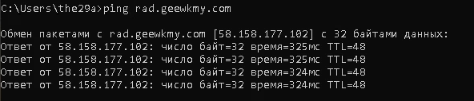
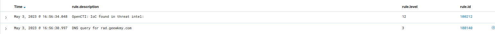

# Wazuh &#43; OpenCTI = Integration?


# Разворачиваем OpenCTI с интеграцией Wazuh

Дефендеры и прочие blue-team, а вы обогащаете данные в своем Wazuh?  

Разумеется, Wazuh используют не везде, но в силу бюджетов его можно встретить даже в крупном бизнесе.  
Сравнительно удобно, бесплатно и можно запихать в Docker.  
&lt;!--more--&gt;
Так вот, переходим к теме.  
Представим, что правила у нас написаны, алерты настроены и от вечного внедрения уже можно перейти к добавлению функционала.  
Например, алерты при обнаружении IoC. А для этого нам нужна какая-то Threat Intelligence платформа.  
В голову приходят только MISP и OpenCTI, последний мы и будем использовать.  


## Типы событий / группы правил возможные для отработки с OpenCTI API

| Event type | metadata | Rationale |
| ---------- | -------- | -------- | 
 sysmon event1 | win.eventdata.hashes | Check existing IoC in process image file hash |
 sysmon event3 | win.eventdata.hashes | Check existing IoC in in destination IP |
 sysmon event6 | win.eventdata.hashes | Check existing IoC in in loaded driver file hash |
 sysmon event7 | win.eventdata.hashes | Check existing IoC in loaded DLL file hash |
 sysmon event 15 | win.eventdata.hashes | Check existing IoC in downloaded file hash |
 sysmon event 22 | win.eventdata.queryName | Check existing IoC in queried hostname |
 sysmon event 23 | win.eventdata.hashes | Check existing IoC in deleted file hash | 
 sysmon event 24 | win.eventdata.hashes | Check existing IoC in clipboard content file hash |
 sysmon event 25 | win.eventdata.hashes | Check existing IoC in process file hash | 
 sysmon process-anomalies | win.eventdata.hashes | -- |
 ids | dest\_ip, src\_ip | -- |
 osquery, osquery\_file | osquery.columns.sha256 | -- |


## Тестовое развертывание
Для теста потребуется:  
1. API-ключ [Alienvault OTX](https://otx.alienvault.com)
2. Wazuh
    - Например [wazuh-docker](https://github.com/wazuh/wazuh-docker)
3. OpenCTI
   - [OpenCTI](https://www.filigran.io/en/products/opencti/)
   - [OpenCTI GitHub](https://github.com/OpenCTI-Platform/opencti)
4. Интеграция OpenCTI с Wazuh 
   - [Github OpenCTI Integration](https://github.com/misje/wazuh-opencti)
5. Windows машина с sysmon и wazuh-agent

### Получаем API-ключ [Alienvault OTX](https://otx.alienvault.com)
- Регистрируемся на [Alienvault OTX](https://otx.alienvault.com), переходим в [alienvault.com/api](https://otx.alienvault.com/api) и забраем наш ключ.

### Разворачиваем [OpenCTI](https://github.com/OpenCTI-Platform/opencti)
- Клонируем репозиторий
```bash
git clone https://github.com/OpenCTI-Platform/docker.git
cd docker
```
- Настраиваем переменные:   
Устанавливаем jq:  
```bash
sudo apt install -y jq
```
Добавляем переменные в `.env`:  
```bash
cd ~/docker
(cat &lt;&lt; EOF
OPENCTI_ADMIN_EMAIL=admin@opencti.io
OPENCTI_ADMIN_PASSWORD=CHANGE_ME
OPENCTI_ADMIN_TOKEN=GENERATE_UUID
OPENCTI_BASE_URL=http://localhost:8080
MINIO_ROOT_USER=opencti
MINIO_ROOT_PASSWORD=CHANGE_ME
RABBITMQ_DEFAULT_USER=opencti
RABBITMQ_DEFAULT_PASS=CHANGE_ME
CONNECTOR_EXPORT_FILE_STIX_ID=dd817c8b-abae-460a-9ebc-97b1551e70e6
CONNECTOR_EXPORT_FILE_CSV_ID=7ba187fb-fde8-4063-92b5-c3da34060dd7
CONNECTOR_EXPORT_FILE_TXT_ID=ca715d9c-bd64-4351-91db-33a8d728a58b
CONNECTOR_IMPORT_FILE_STIX_ID=72327164-0b35-482b-b5d6-a5a3f76b845f
CONNECTOR_IMPORT_DOCUMENT_ID=c3970f8a-ce4b-4497-a381-20b7256f56f0
SMTP_HOSTNAME=localhost
ELASTIC_MEMORY_SIZE=4G
ALIENVAULT_API_KEY=API_KEY
ALIENVAULT_CONNECTOR_ID=GENERATE_UUID
EOF
 ) &gt; .env
```
В полученный файл необходимо добавить свои переменные, будь это API-токен, почта или что-то ещё. 
Можно указать прямо в файле, но лучше, если сами переменные хранятся в глобальном окружении.

Так же не забываем заменить GENERATE_UUID на валидные UUID, которые можно сгенерировать либо с помощью утилиты `uuidgen` или онлайн-генератором [uuidgenerator.net](https://www.uuidgenerator.net/version4).  


- Добавлю сразу, что помимо самого OpenCTI и интеграции в Wazuh нам необходимы т.н. [external-import connectors](https://github.com/OpenCTI-Platform/connectors/tree/master/external-import), и для примера будем использовать [коннектор от alienvault](https://github.com/OpenCTI-Platform/connectors/tree/master/external-import/alienvault)
- Чтобы не плодить множество compose-файлов, забираем [отсюда](https://raw.githubusercontent.com/OpenCTI-Platform/connectors/master/external-import/alienvault/docker-compose.yml) часть от `connector-alienvault:` до  `restart: always`, так же добавляем часть в конец     
```
    depends_on:
      - opencti 
```

Что у нас должно получиться [(GIST)](https://gist.github.com/the29a/9cac7e57ec99b35000453b0b0e50a1dc):


{{&lt; spoiler text=&#34;Click to view the spoiler&#34; &gt;}}

```yaml
version: &#39;3&#39;
services:
  redis:
    image: redis:7.0.9
    restart: always
    volumes:
      - redisdata:/data
  elasticsearch:
    image: docker.elastic.co/elasticsearch/elasticsearch:8.6.2
    volumes:
      - esdata:/usr/share/elasticsearch/data
    environment:
      # Comment out the line below for single-node
      - discovery.type=single-node
      # Uncomment line below below for a cluster of multiple nodes
      # - cluster.name=docker-cluster
      - xpack.ml.enabled=false
      - xpack.security.enabled=false
      - &#34;ES_JAVA_OPTS=-Xms${ELASTIC_MEMORY_SIZE} -Xmx${ELASTIC_MEMORY_SIZE}&#34;
    restart: always
    ulimits:
      memlock:
        soft: -1
        hard: -1
      nofile:
        soft: 65536
        hard: 65536
  minio:
    image: minio/minio:RELEASE.2023-02-27T18-10-45Z
    volumes:
      - s3data:/data
    ports:
      - &#34;9000:9000&#34;
    environment:
      MINIO_ROOT_USER: ${MINIO_ROOT_USER}
      MINIO_ROOT_PASSWORD: ${MINIO_ROOT_PASSWORD}    
    command: server /data
    healthcheck:
      test: [&#34;CMD&#34;, &#34;curl&#34;, &#34;-f&#34;, &#34;http://localhost:9000/minio/health/live&#34;]
      interval: 30s
      timeout: 20s
      retries: 3
    restart: always
  rabbitmq:
    image: rabbitmq:3.11-management
    environment:
      - RABBITMQ_DEFAULT_USER=${RABBITMQ_DEFAULT_USER}
      - RABBITMQ_DEFAULT_PASS=${RABBITMQ_DEFAULT_PASS}
    volumes:
      - amqpdata:/var/lib/rabbitmq
    restart: always
  opencti:
    image: opencti/platform:5.7.1
    environment:
      - NODE_OPTIONS=--max-old-space-size=8096
      - APP__PORT=8080
      - APP__BASE_URL=${OPENCTI_BASE_URL}
      - APP__ADMIN__EMAIL=${OPENCTI_ADMIN_EMAIL}
      - APP__ADMIN__PASSWORD=${OPENCTI_ADMIN_PASSWORD}
      - APP__ADMIN__TOKEN=${OPENCTI_ADMIN_TOKEN}
      - APP__APP_LOGS__LOGS_LEVEL=error
      - REDIS__HOSTNAME=redis
      - REDIS__PORT=6379
      - ELASTICSEARCH__URL=http://elasticsearch:9200
      - MINIO__ENDPOINT=minio
      - MINIO__PORT=9000
      - MINIO__USE_SSL=false
      - MINIO__ACCESS_KEY=${MINIO_ROOT_USER}
      - MINIO__SECRET_KEY=${MINIO_ROOT_PASSWORD}
      - RABBITMQ__HOSTNAME=rabbitmq
      - RABBITMQ__PORT=5672
      - RABBITMQ__PORT_MANAGEMENT=15672
      - RABBITMQ__MANAGEMENT_SSL=false
      - RABBITMQ__USERNAME=${RABBITMQ_DEFAULT_USER}
      - RABBITMQ__PASSWORD=${RABBITMQ_DEFAULT_PASS}
      - SMTP__HOSTNAME=${SMTP_HOSTNAME}
      - SMTP__PORT=25
      - PROVIDERS__LOCAL__STRATEGY=LocalStrategy
    ports:
      - &#34;8080:8080&#34;
    depends_on:
      - redis
      - elasticsearch
      - minio
      - rabbitmq
    restart: always
  worker:
    image: opencti/worker:5.7.1
    environment:
      - OPENCTI_URL=http://opencti:8080
      - OPENCTI_TOKEN=${OPENCTI_ADMIN_TOKEN}
      - WORKER_LOG_LEVEL=info
    depends_on:
      - opencti
    deploy:
      mode: replicated
      replicas: 3
    restart: always
  connector-export-file-stix:
    image: opencti/connector-export-file-stix:5.7.1
    environment:
      - OPENCTI_URL=http://opencti:8080
      - OPENCTI_TOKEN=${OPENCTI_ADMIN_TOKEN}
      - CONNECTOR_ID=${CONNECTOR_EXPORT_FILE_STIX_ID} # Valid UUIDv4
      - CONNECTOR_TYPE=INTERNAL_EXPORT_FILE
      - CONNECTOR_NAME=ExportFileStix2
      - CONNECTOR_SCOPE=application/json
      - CONNECTOR_CONFIDENCE_LEVEL=15 # From 0 (Unknown) to 100 (Fully trusted)
      - CONNECTOR_LOG_LEVEL=info
    restart: always
    depends_on:
      - opencti
  connector-export-file-csv:
    image: opencti/connector-export-file-csv:5.7.1
    environment:
      - OPENCTI_URL=http://opencti:8080
      - OPENCTI_TOKEN=${OPENCTI_ADMIN_TOKEN}
      - CONNECTOR_ID=${CONNECTOR_EXPORT_FILE_CSV_ID} # Valid UUIDv4
      - CONNECTOR_TYPE=INTERNAL_EXPORT_FILE
      - CONNECTOR_NAME=ExportFileCsv
      - CONNECTOR_SCOPE=text/csv
      - CONNECTOR_CONFIDENCE_LEVEL=15 # From 0 (Unknown) to 100 (Fully trusted)
      - CONNECTOR_LOG_LEVEL=info
    restart: always
    depends_on:
      - opencti
  connector-export-file-txt:
    image: opencti/connector-export-file-txt:5.7.1
    environment:
      - OPENCTI_URL=http://opencti:8080
      - OPENCTI_TOKEN=${OPENCTI_ADMIN_TOKEN}
      - CONNECTOR_ID=${CONNECTOR_EXPORT_FILE_TXT_ID} # Valid UUIDv4
      - CONNECTOR_TYPE=INTERNAL_EXPORT_FILE
      - CONNECTOR_NAME=ExportFileTxt
      - CONNECTOR_SCOPE=text/plain
      - CONNECTOR_CONFIDENCE_LEVEL=15 # From 0 (Unknown) to 100 (Fully trusted)
      - CONNECTOR_LOG_LEVEL=info
    restart: always
    depends_on:
      - opencti
  connector-import-file-stix:
    image: opencti/connector-import-file-stix:5.7.1
    environment:
      - OPENCTI_URL=http://opencti:8080
      - OPENCTI_TOKEN=${OPENCTI_ADMIN_TOKEN}
      - CONNECTOR_ID=${CONNECTOR_IMPORT_FILE_STIX_ID} # Valid UUIDv4
      - CONNECTOR_TYPE=INTERNAL_IMPORT_FILE
      - CONNECTOR_NAME=ImportFileStix
      - CONNECTOR_VALIDATE_BEFORE_IMPORT=true # Validate any bundle before import
      - CONNECTOR_SCOPE=application/json,text/xml
      - CONNECTOR_AUTO=true # Enable/disable auto-import of file
      - CONNECTOR_CONFIDENCE_LEVEL=15 # From 0 (Unknown) to 100 (Fully trusted)
      - CONNECTOR_LOG_LEVEL=info
    restart: always
    depends_on:
      - opencti
  connector-import-document:
    image: opencti/connector-import-document:5.7.1
    environment:
      - OPENCTI_URL=http://opencti:8080
      - OPENCTI_TOKEN=${OPENCTI_ADMIN_TOKEN}
      - CONNECTOR_ID=${CONNECTOR_IMPORT_DOCUMENT_ID} # Valid UUIDv4
      - CONNECTOR_TYPE=INTERNAL_IMPORT_FILE
      - CONNECTOR_NAME=ImportDocument
      - CONNECTOR_VALIDATE_BEFORE_IMPORT=true # Validate any bundle before import
      - CONNECTOR_SCOPE=application/pdf,text/plain,text/html
      - CONNECTOR_AUTO=true # Enable/disable auto-import of file
      - CONNECTOR_ONLY_CONTEXTUAL=false # Only extract data related to an entity (a report, a threat actor, etc.)
      - CONNECTOR_CONFIDENCE_LEVEL=15 # From 0 (Unknown) to 100 (Fully trusted)
      - CONNECTOR_LOG_LEVEL=info
      - IMPORT_DOCUMENT_CREATE_INDICATOR=true
    restart: always
    depends_on:
      - opencti
  connector-alienvault:
    image: opencti/connector-alienvault:5.7.1
    environment:
      - OPENCTI_URL=http://opencti:8080
      - OPENCTI_TOKEN=${OPENCTI_ADMIN_TOKEN}
      - CONNECTOR_ID=${ALIENVAULT_CONNECTOR_ID}
      - CONNECTOR_TYPE=EXTERNAL_IMPORT
      - CONNECTOR_NAME=AlienVault
      - CONNECTOR_SCOPE=alienvault
      - CONNECTOR_CONFIDENCE_LEVEL=15 # From 0 (Unknown) to 100 (Fully trusted)
      - CONNECTOR_UPDATE_EXISTING_DATA=false
      - CONNECTOR_LOG_LEVEL=info
      - ALIENVAULT_BASE_URL=https://otx.alienvault.com
      - ALIENVAULT_API_KEY=${ALIENVAULT_API_KEY}
      - ALIENVAULT_TLP=White
      - ALIENVAULT_CREATE_OBSERVABLES=true
      - ALIENVAULT_CREATE_INDICATORS=true
      - ALIENVAULT_PULSE_START_TIMESTAMP=2020-05-01T00:00:00                  # BEWARE! Could be a lot of pulses!
      - ALIENVAULT_REPORT_TYPE=threat-report
      - ALIENVAULT_REPORT_STATUS=New
      - ALIENVAULT_GUESS_MALWARE=false                                        # Use tags to guess malware.
      - ALIENVAULT_GUESS_CVE=false                                            # Use tags to guess CVE.
      - ALIENVAULT_EXCLUDED_PULSE_INDICATOR_TYPES=FileHash-MD5,FileHash-SHA1  # Excluded Pulse indicator types.
      - ALIENVAULT_ENABLE_RELATIONSHIPS=true                                  # Enable/Disable relationship creation between SDOs.
      - ALIENVAULT_ENABLE_ATTACK_PATTERNS_INDICATES=true                      # Enable/Disable &#34;indicates&#34; relationships between indicators and attack patterns
      - ALIENVAULT_INTERVAL_SEC=1800
    restart: always
    depends_on:
      - opencti  

volumes:
  esdata:
  s3data:
  redisdata:
  amqpdata:

```
{{&lt; /spoiler &gt;}}
&lt;br&gt;

### Запускаем OpenCTI
Подгружаем переменные:
```bash
set -a ; source .env
```
Запускаем контейнеры:
```bash
docker-compose up -d
```

### Запускаем Wazuh
Если нет Wazuh, то разворачиваем его в [Docker](https://github.com/wazuh/wazuh-docker)

```bash
git clone https://github.com/wazuh/wazuh-docker
cd /wazuh-docker/single-node/
docker-compose up
```

Добавляем интеграцию [wazuh-opencti](https://github.com/misje/wazuh-opencti):
- Из интергации нам потребуются два файла, которые необходимо расположить в `/var/ossec/integrations`. Если позволяет навык, можно добавить из через отдельный volume, либо забрать напрямую из контейнера в с помощью wget.  

Запускаем из контейнера:
```bash
curl https://raw.githubusercontent.com/misje/wazuh-opencti/main/custom-opencti.py -o /var/ossec/integrations/custom-opencti.py
curl https://raw.githubusercontent.com/misje/wazuh-opencti/main/custom-opencti -o /var/ossec/integrations/custom-opencti
```

- Добавляем настройки в wazuh-manager:
```xml
  &lt;!-- OpenCTI Integration --&gt;
  &lt;integration&gt;
    &lt;name&gt;custom-opencti&lt;/name&gt;
    &lt;group&gt;sysmon_eid1_detections,sysmon_eid3_detections,sysmon_eid7_detections,sysmon_eid22_detections,syscheck_file,osquery_file,ids,sysmon_process-anomalies&lt;/group&gt;
    &lt;alert_format&gt;json&lt;/alert_format&gt;
    &lt;api_key&gt;YOUR_TOKEN_HERE&lt;/api_key&gt;
    &lt;hook_url&gt;http://&lt;YOUR-OPENCTI-HOST&gt;:8080/graphql&lt;/hook_url&gt;
  &lt;/integration&gt;
```

- Добавляем правила обнаружения:
```xml
&lt;group name=&#34;threat_intel,&#34;&gt;
   &lt;rule id=&#34;100210&#34; level=&#34;10&#34;&gt;
      &lt;field name=&#34;integration&#34;&gt;opencti&lt;/field&gt;
      &lt;description&gt;OpenCTI&lt;/description&gt;
      &lt;group&gt;opencti,&lt;/group&gt;
   &lt;/rule&gt;
   &lt;rule id=&#34;100211&#34; level=&#34;5&#34;&gt;
      &lt;if_sid&gt;100210&lt;/if_sid&gt;
      &lt;field name=&#34;opencti.error&#34;&gt;\.&#43;&lt;/field&gt;
      &lt;description&gt;OpenCTI: Failed to connect to API&lt;/description&gt;
      &lt;options&gt;no_full_log&lt;/options&gt;
      &lt;group&gt;opencti,opencti_error,&lt;/group&gt;
	&lt;/rule&gt;
   &lt;rule id=&#34;100212&#34; level=&#34;12&#34;&gt;
      &lt;if_sid&gt;100210&lt;/if_sid&gt;
      &lt;field name=&#34;opencti.id&#34;&gt;\.&#43;&lt;/field&gt;
      &lt;description&gt;OpenCTI: IoC found in threat intel: $(opencti.x_opencti_description)&lt;/description&gt;
      &lt;options&gt;no_full_log&lt;/options&gt;
      &lt;group&gt;opencti,opencti_alert,&lt;/group&gt;
   &lt;/rule&gt;
&lt;/group&gt;
```
Дополнительно добавим небольшое правило для логирования событий запроса DNS:
```xml
&lt;group name=&#34;sysmon,sysmon_eid22_detections,windows,&#34;&gt;
   &lt;rule id=&#34;100140&#34; level=&#34;3&#34;&gt;
      &lt;if_sid&gt;61650&lt;/if_sid&gt;
      &lt;description&gt;DNS query for $(win.eventdata.queryName)&lt;/description&gt;
   &lt;/rule&gt;
&lt;/group&gt;
```
&gt;Особое внимание уделите группам правил, в вашем случае они могут отличаться.

### Разворачиваем Windows и ставим sysmon
- Запускаем powershell от администратора и запускаем установку sysmon:
```powershell
Set-Location C:\Windows\
Invoke-WebRequest -Uri https://download.sysinternals.com/files/Sysmon.zip -Outfile Sysmon.zip
Expand-Archive Sysmon.zip -force
Write-Host &#34;Unzip Complete.&#34;
Invoke-WebRequest -Uri https://raw.githubusercontent.com/SwiftOnSecurity/sysmon-config/master/sysmonconfig-export.xml  -OutFile sysmonconfig-export.xml
./Sysmon/sysmon64.exe -accepteula -i sysmonconfig-export.xml
```
- Устанавливаем Wazuh Agent
```powershell
Invoke-WebRequest -Uri https://packages.wazuh.com/4.x/windows/wazuh-agent-4.4.1-1.msi -OutFile ${env:tmp}\wazuh-agent.msi; msiexec.exe /i ${env:tmp}\wazuh-agent.msi /q WAZUH_MANAGER=&#39;192.168.93.97&#39; WAZUH_REGISTRATION_SERVER=&#39;192.168.93.97&#39; WAZUH_AGENT_GROUP=&#39;default&#39; WAZUH_AGENT_NAME=&#39;test_win&#39; 
```
- Добавляем настройки в ossec.conf
```xml
  &lt;!-- Sysmon Config --&gt;
  &lt;localfile&gt;
  &lt;location&gt;Microsoft-Windows-Sysmon/Operational&lt;/location&gt;
  &lt;log_format&gt;eventchannel&lt;/log_format&gt;
  &lt;/localfile&gt;
```
- Запускаем wazuh-agent
```shell
NET START WazuhSvc
```

### Тестирование
Так как у нас есть правила на ICMP запросы, их мы и проверим:
```powershell
ping rad.geewkmy.com
```


В случае корректной настройки в Security Events мы увидим следующее:
 

### Возможные проблемы:
При развертывании Wazuh в Docker нет python3 и request:
```bash
sudo apt update
sudo apt install python3 python3-pip
pip3 install requests
```

Возможно, для production не лучший выход, но для тестового развертывания подойдет.

### Итог
Данная статья не претендует на звание исчерпывающего руководства, и больше преследовалась цель показать, что сравнительно небольших усилиях можно сильно упростить себе жизнь.
Разумеется, ICMP-запросами это не ограничивается, но для этого нужно писать правила.


---

Reference:  
[OpenCTI Connectors](https://github.com/OpenCTI-Platform/connectors) 
[OpenCTI Datasets](https://github.com/OpenCTI-Platform/datasets)   
[OpenCTI Public Knowledge Base](https://filigran.notion.site/OpenCTI-Public-Knowledge-Base-d411e5e477734c59887dad3649f20518)  
[OpenCTI Data Connectors - Add Data Connectors to Your OpenCTI Stack!](https://youtu.be/_7TuBYdOo7k)  
[Wazuh SIEM — OpenCTI Threat Intel Integration](https://socfortress.medium.com/wazuh-siem-opencti-threat-intel-integration-4cb1a3810250)  
[Github OpenCTI Integration (Not work)](https://github.com/juaromu/wazuh-opencti)  
[Running OpenCTI using Docker](https://filigran.notion.site/Using-Docker-03d5c0592b9d4547800cc9f4ff7be2b8)  


---

> Author:   
> URL: http://localhost:1313/posts/wazuh_opencti_integration/  

